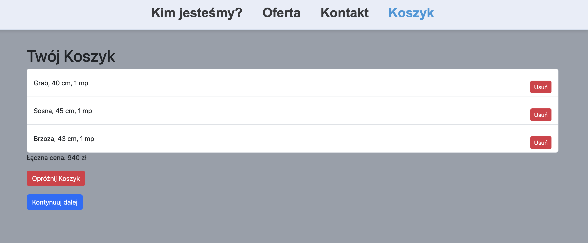

## :bookmark_tabs: About This Project

This website, hosted on a VPS server, has been created for my client, who sells firewood in Toruń and the surrounding areas. Customers can add products to their cart and place an order. After placing an order, the company receives the order for processing, and the customer receives an order confirmation via email. Additionally, customers can contact the company through the contact form if they prefer the traditional way. You can visit this site at www.drewno-kominkowe-torun.pl.

## :hammer_and_wrench: Used Technologies

* Spring (Boot, Data)
* JPA / Hibernate
* MySql
* Thymeleaf
* HTML, CSS
* Maven
* Lombok

## :camera: Screenshots

Landing page      |  Offer
:------------------------:|:-------------------------:
  |  

Contact us      |  Cart
:------------------------:|:-------------------------:
  |  

Checkout      |  Order placed
:------------------------:|:-------------------------:
  |  

New order from client      |  Order confirmation
:------------------------:|:-------------------------:
  |  
